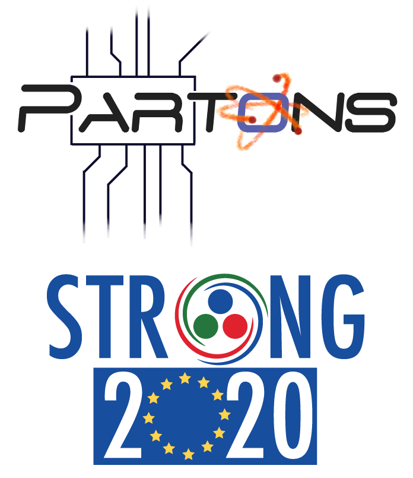

# Main Page                          {#mainpage}

# What is PARTONS? {#mainpage_intro}

%PARTONS is a software framework dedicated to the phenomenology of 3D hadron structure, in particular Generalized Parton Distributions (GPDs) and Tranverse Momentum Dependent (TMDs) parton distribution functions.

The experimental program devoted to study GPDs and TMDs has been carrying out by experiments in several facilities, like CERN, DESY, Fermilab, Jefferson Lab and BNL. The 3D structure of hadrons will be also a key component of the physics case for the future US electron ion collider (EIC) and Chinese electron ion collider (EIcC). %PARTONS is useful to theorists to develop new models, phenomenologists to interpret existing measurements and to experimentalists to design new experiments.

%PARTONS provides a necessary bridge between GPD models and experimental data measured in various channels, like for example deeply virtual Compton scattering (DVCS), timelike Compton scattering (TCS) and hard exclusive meson production (HEMP).

# What is 3DPartons? {#mainpage_strong_wp}

3DPartons is a [virtual access infrastructure](http://www.strong-2020.eu/all-activities/virtual-access.html) supported by the European project [STRONG-2020](http://www.strong-2020.eu). 3DPartons gives access to open-source computing codes necessary for high precision phenomenology in the field of 3D hadron structure. Benefiting from the experience of decades of parton distribution function (PDF) studies, the GPD and TMD communities can find in 3DPartons a forum where they can mutualize knowledge and know-how about scientific and technical problems related to the complexity of the GPD and TMD computing chains. 

The virtual access infrastructure 3DPartons has received funding from the European Union’s Horizon 2020 research and innovation programme under grant agreement No 824093. 

[NangaParbat](https://github.com/MapCollaboration/NangaParbat) is a fitting framework for the determination of TMDs from experimental data, like for example Drell-Yan measurements. The corresponding fitted TMDs can also be accessed through [TMDlib](https://tmdlib.hepforge.org).
[MontBlanc](https://github.com/MapCollaboration/MontBlanc) is a fitting framework for the determination of FFs from experimental data for single inclusive annihilation (SIA) and semi inclusive deep inelastic scattering (SIDIS).
[xFitter](https://www.xfitter.org/xFitter/) is a fitting framework for the determination of collinear distributions from a vast body of experimental channels. 
%PARTONS,  NangaParbat, MontBlanc and xFitter share the common feature of being interfaced to [APFEL++](https://github.com/vbertone/apfelxx) which solves QCD evolution equations for various parton distributions, and to [LHAPDF](https://lhapdf.hepforge.org) which provides access to modern PDF sets.

[EpIC](https://github.com/pawelsznajder/epic) is a generic Monte Carlo event generator for exclusive processes. It is fully compatible with %PARTONS: it can be used to generate events for all exclusive processes and all models provided by %PARTONS. 

# Get PARTONS {#mainpage_get}

Here you can learn how to get your own version of %PARTONS. We offer two ways. You can use our provided virtual machine with an out-of-the-box %PARTONS runtime and development environment. This is the easiest way to start your experience with %PARTONS. Alternatively, you can also build %PARTONS by your own on <!-- either --> GNU/Linux<!--  or Mac OS X -->. This is useful if you want to have %PARTONS on your computer without using the virtualization technology or if you want to use %PARTONS on computing farms. 

* [Download page](@ref download).

Tutorials:
* [Using PARTONS with our provided Virtual Machine](@ref vm).
* [Using PARTONS on GNU/Linux](@ref linux). <!-- 
* [Using PARTONS on Mac OS X](@ref mac).-->

# Configure PARTONS {#mainpage_conf} 

If you are using [our virtual machine](@ref vm), you will find all configuration files set up and ready to be used. However, if you want to tune the configuration or if you have installed %PARTONS by your own, this tutorial will be helpful for you:

* [Manual configuration](@ref config).

# How to use PARTONS {#mainpage_howtouse}

At this point you should have your own version of %PARTONS available and ready to be used. We provide two ways of using %PARTONS: by executing _scenarios_ encoded in simple XML files, or by using the %PARTONS library and its headers to write your own stand-alone program. The first way allows to use %PARTONS without writing a line of code in C++ and rebuilding the project, while the second way is suitable for the most complex tasks. 

%PARTONS benefits from a modular structure. If you want to extend %PARTONS, you can create your own module, as for instance a new GPD model, plug it in and use all functionalities offered by the project.

When working with %PARTONS you may want to configure and use an integrated development environment (IDE), such as Eclipse. Note, that if your are using [our virtual machine](@ref vm), you will find Eclipse already configured there and ready to be used. 

When working with %PARTONS, one may also want to use also an SQL database, e.g. to keep track of results obtained in the past, to avoid repeating time-consuming computations or to store experimental results.

The following tutorials deal with all these matters:
* [Quick guide on how to use PARTONS](@ref quick).
* [Using the PARTONS library](@ref usage).
* [Writing your own module](@ref newmodule).
* [Using PARTONS with the Eclipse CDT IDE](@ref eclipse).
* [Using PARTONS with a database](@ref database).

# License and reference {#mainpage_licences}

The following licenses apply: [elementary-utils](https://drf-gitlab.cea.fr/partons/core/elementary-utils) sub-project is under the [Apache](https://www.apache.org/licenses/) license, while [numa](https://drf-gitlab.cea.fr/partons/core/numa), [partons](https://drf-gitlab.cea.fr/partons/core/partons) and [partons-example](https://drf-gitlab.cea.fr/partons/core/partons-example) are distributed under the [GPL](https://www.gnu.org/licenses/gpl.html) license. Please, respect the licensing! 

To reference %PARTONS please use this publication: 
* B. Berthou *et al.*, *%PARTONS: PARtonic Tomography Of Nucleon Software: A computing platform for the phenomenology of Generalized Parton Distributions*, Eur. Phys. J. C78 (2018), 478, [DOI: 10.1140/epjc/s10052-018-5948-0](https://doi.org/10.1140/epjc/s10052-018-5948-0)

and add the following sentence in the acknowledgments of papers and talks: *The virtual access infrastructure 3DPartons has received funding from the European Union’s Horizon 2020 research and innovation programme under grant agreement No 824093.*

%PARTONS project was also supported by the Grant No. 2017/26/M/ST2/01074 of the National Science Centre, Poland.

# Contact and newsletter {#mainpage_contact}

Description of the %PARTONS developement team and contacts can be found [here](@ref contact). If you would like to be informed on the new versions of %PARTONS, sign up for the [newsletter](@ref contact_newsletter).
