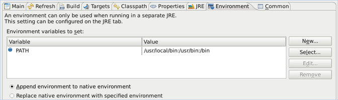

# PARTONS on MacOS {#mac}

[TOC]

# Introduction {#mac_intro}

This tutorial is for building PARTONS on Mac OS. It was tested on Sierra.

# Dependencies {#mac_dependencies}

## brew {#mac_brew}

%All of the needed libraries are available via [Homebrew](https://brew.sh). First install brew (if not already available) by running the following command on a terminal window:

```sh
/usr/bin/ruby -e "$(curl -fsSL https://raw.githubusercontent.com/Homebrew/install/master/install)"
```

## External libraries {#mac_libraries}

Once brew has been installed, run the following commands to install the following libraries:

* **CLN**
```sh
brew install cln
```

*  **Eigen**
```sh
brew install eigen
```

* **Qt (v4 required)**
```sh
brew tap cartr/qt4
brew tap-pin cartr/qt4
brew install qt@4
```

* **SFML**
```sh
brew install sfml
```

## Git {#mac_git}

PARTONS resides on GitLab; so to pull the sources from the repository you will need Git (not necessary if you download the source archives):
```sh
brew install git
``` 

## CMake and Ant {mac_cmake}

Building PARTONS requires CMake. You can brew it as usual:
```sh
brew install cmake
```

Optionally, you can install Ant in order to take advantage of the `build.xml` files included with PARTONS. To do that, guess what?
```sh
brew install ant
```

# Build and install PARTONS {#mac_partons}

From this point on, the tutorial becomes almost indistinguishable from the [Linux tutorial](@ref linux), so you can [switch to it for the rest](@ref linux_source) (or if you want to use an IDE such as Eclipse, [switch to the corresponding tutorial](@ref eclipse)) and read the following section for troubleshooting specific to Mac.

# Troubleshooting {#mac_troubleshooting}

* If you are using Eclipse on Mac, you may encounter this error when using `cmake` via *Ant* scripts: 
~~~~~~~~~~~~~{.sh}
Execute failed: java.io.IOException: Cannot run program "cmake" (in directory "..."): error=13, Permission denied
~~~~~~~~~~~~~
which appears as Eclipse is unable to localize CMake executable. To solve this problem right-click on one of entries in `Ant` view and navigate through the menu: **Run us** > **External Tools Configurations**. In the new window select **Environment** tab. Click on **Select** button that will call a new window. Select **PATH** variable and click on **OK** button. Modify value by adding a path to `cmake` executable, most likely `/usr/local/bin`. Unless CMake is installed in a custom place, you can get this path by running
~~~~~~~~~~~~~{.sh}
which cmake 
~~~~~~~~~~~~~
in your terminal. With `PATH` variable modified, click on **Apply** button and **Close** one to finish.
