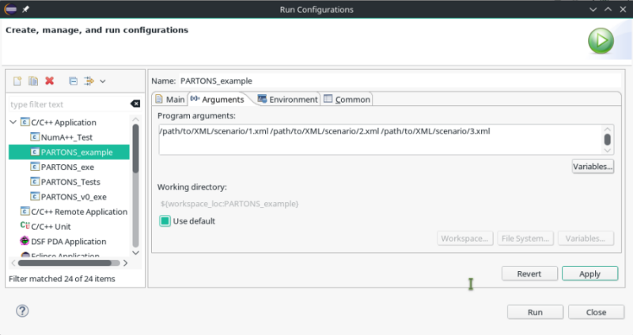

# Quick quide {#quick}

[TOC]

# Introduction {#quick_intro}

The purpose of this tutorial is to demonstrate how to run %PARTONS with no questions asked. The full tutorial for %PARTONS usage can be found [here](@ref usage). We assume that %PARTONS installation is available to you, i.e. you use either [our virtual machine](@ref vm) or your own installation on [Linux](@ref linux) or [Mac](@ref mac). 

For the demonstration we will use [partons-example](https://drf-gitlab.cea.fr/partons/core/partons-example) project. You can run the executable either from a terminal (the most straightforward way) or from Eclipse IDE.

<hr>

# Run partons-example in terminal {#quick_console}

* Open the terminal 
* Go to the root directory of [partons-example](https://drf-gitlab.cea.fr/partons/core/partons-example) project
```sh
# on our virtual machine
cd /home/partons/git/partons-example
```
* Run one of the examples
```sh
./bin/PARTONS_example data/examples/gpd/computeSingleKinematicsForGPD.xml
```
* At this point you should see the output of played scenario: values of GPDs, including singlet and non-singlet combinations, for a single kinematics and for GPD types and partons available in the chosen model. Study the example by using, e.g. `mousepad` text editor
```sh
mousepad data/examples/gpd/computeSingleKinematicsForGPD.xml
```
You will find more examples of XML scenarios to play with in `data/examples` directory.

<hr>

# Run partons-example in Eclipse {#quick_eclipse}

* Open Eclipse 
* Specify the examplary XML scenario to be played: right-click on [partons-example](https://drf-gitlab.cea.fr/partons/core/partons-example) project in **Project Explorer** view, then **Run as** > **Run Configurations** and then under **C/C++ Application** > **PARTONS_example**. Go to **Arguments** tab and add there a path to XML scenario you want to play (you may also indicate few scenarios to be played consecutively).

* At this point you should see the output of played scenario in **Console** view: values of GPDs, including singlet and non-singlet combinations, for a single kinematics and for GPD types and partons available in the chosen model. Study the example by opening it via **Project Explorer** view. You will find more examples of XML scenarios to play with in `data/examples` directory.

