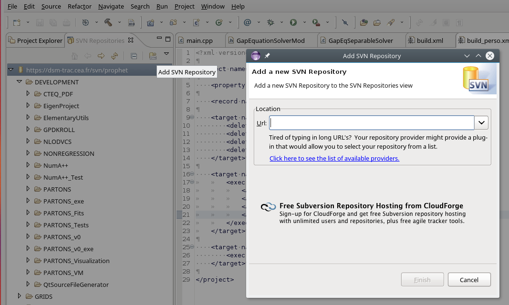
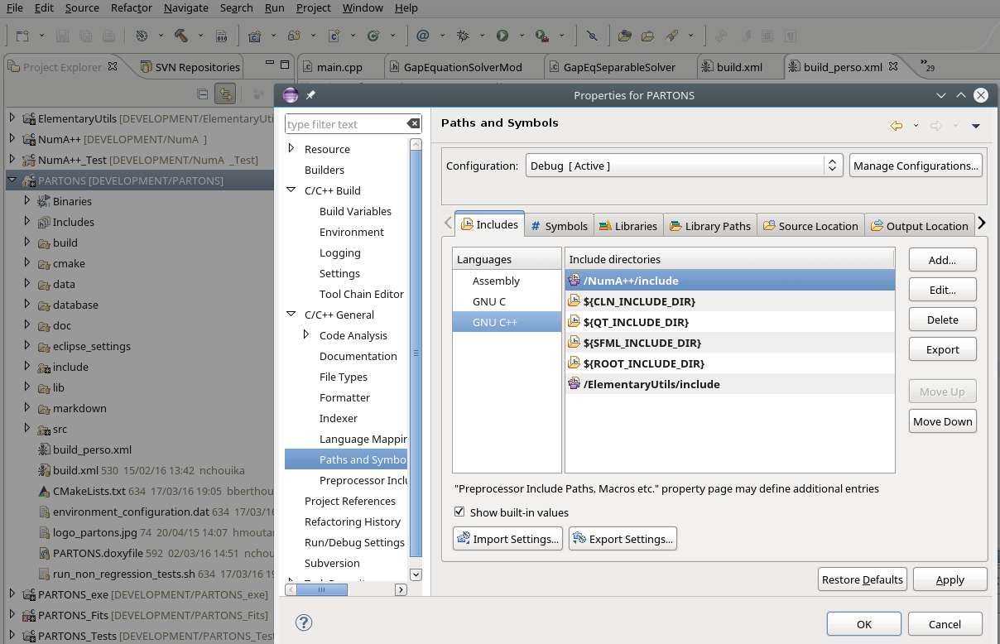
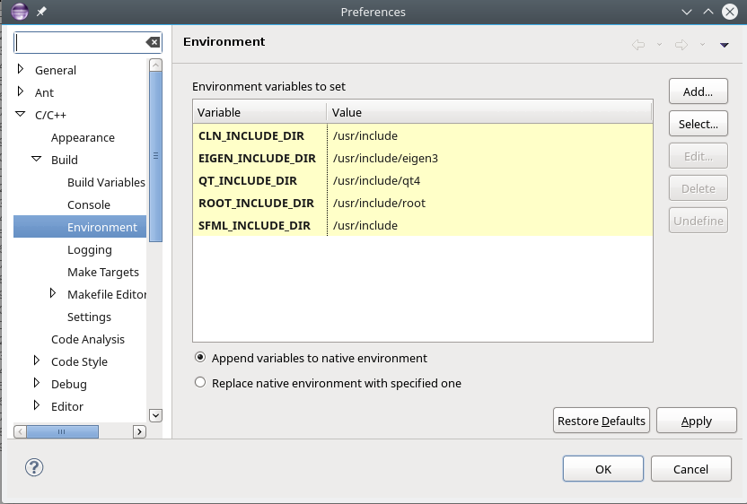
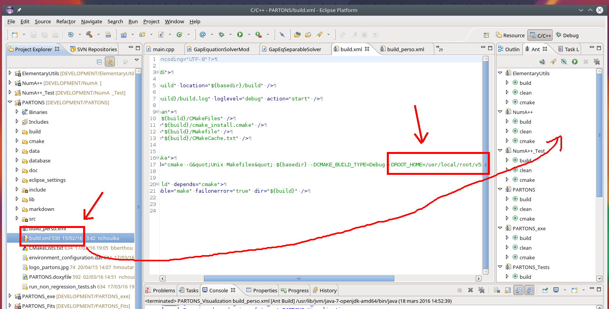
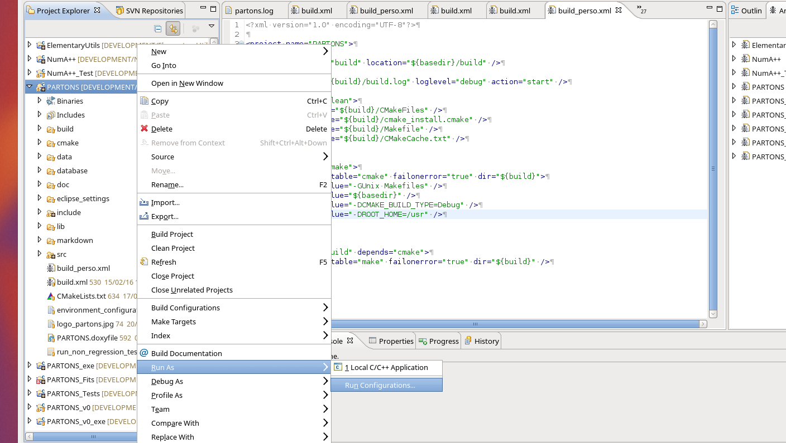
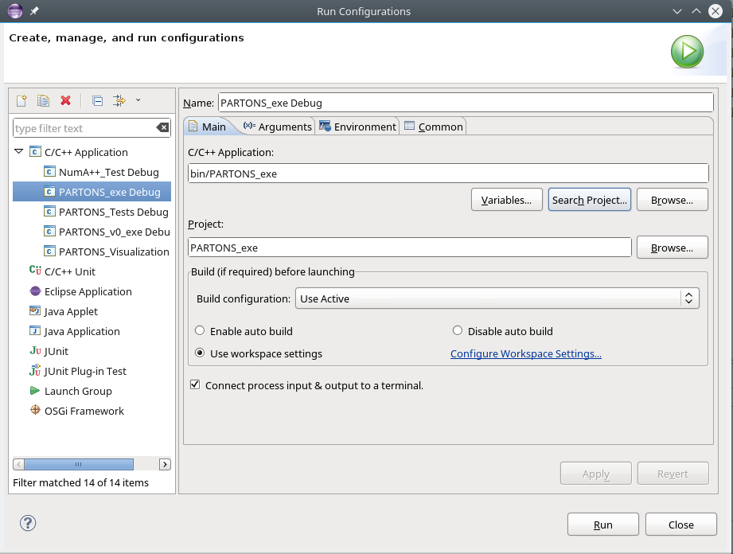
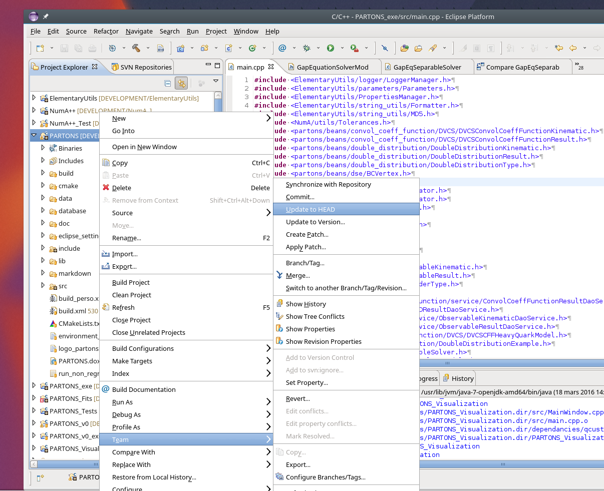
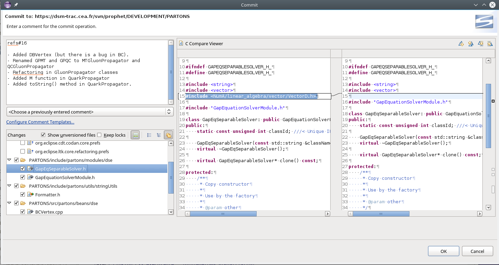
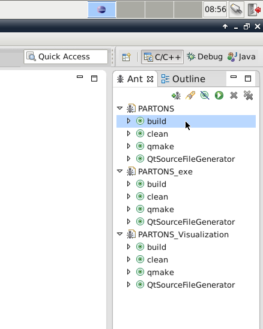
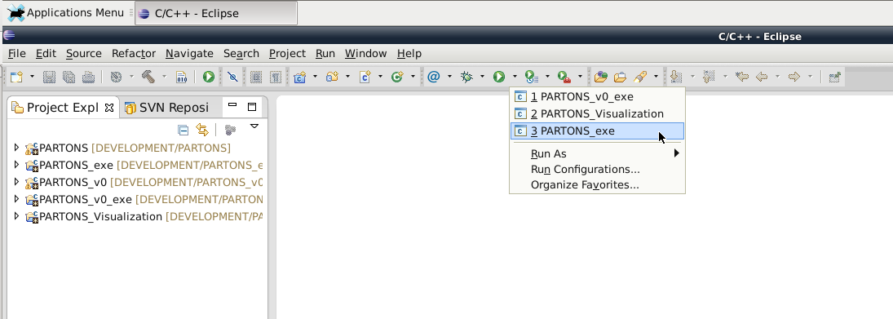

# Using Eclipse as IDE for PARTONS    {#eclipse}

This tutorial will help you code with/in PARTONS with the Eclipse CDT IDE.

[TOC]

# Configuring Eclipse for PARTONS {#eclipse_configure}

If you're using the Virtual Machine provided with PARTONS, you can skip that part (Eclipse is already well configured) and go to the [next section](@ref eclipse_use).

## Checkout Projects ## {#eclipse_checkout}

The first thing to do is to checkout the projects. Be sure to have SVN (package `subversion` on Debian-like distros) and the SVN plugin `subclipse` for Eclipse (package `eclipse-subclipse` on Debian-like distros, or alternatively via the plugin installer of Eclipse, i.e. __Help__ > __Eclipse Marketplace__) installed.

Go to the SVN Repositories view of Eclipse (if you don't have it, go the Menu bar > __Window__ > __Show View__ > __Other__ > __SVN__ > __SVN Repositories__). Click on the __Add SVN repository__ icon:

Add the URL of the repository: (TODO: adapt the URL when PARTONS is released)

~~~~~~~~~~~~~
https://dsm-trac.cea.fr/svn/prophet/DEVELOPMENT
~~~~~~~~~~~~~

Now, you can see the SVN tree and checkout the projects: Select all the projects you need (ElementaryUtils, NumA++, PARTONS, PARTONS_release), right-click and choose __Checkout__. Keep everything as it is, and click on Finish.

Now, you can switch to the __Project Explorer__ view.

## Configuring Projects ## {#eclipse_configure_projects}

You might want to let Eclipse resolve all the includes and index everything correctly, for comfort purposes (and not practical reasons, since we don't use Eclipse to build the projects but CMake, see [below](@ref eclipse_build)). For that, you usually need to specify the paths in the projects properties. Those configurations files though are already preconfigured and stored on the SVN. You can see by yourself on the following screenshot:

So, for the projects in the workspace, nothing else to do (unless you installed the libraries ElementaryUtils, NumA++ or PARTONS elsewhere, in that case, you need to adapt the path). The remaining issue is that the external libraries paths might be different on your system. That's why they were only configured with global variables on the projects properties, so that you don't have to fix it on each project. You only need to define those global variables on Eclipse's preferences: Go to __Window__ > __Preferences__ > __C/C__++ > __Build__ > __Environment__ and add the variables of the following screenshot with the paths of your own system (if you installed the system packages as in the [Linux](@ref linux) tutorial, the paths should be the same as in the screenshot):

## Building the projects ## {#eclipse_build}

The build is done through CMake. Be sure to have it installed (package `cmake` on Debian-like distros). We use Ant scripts, which are xml files, to chain the call to `cmake` and `make`. Those scripts are already on SVN, but you need to load them. For each project, there is a `build.xml` file. You need to drag and drop it to the Ant view (if you don't have it, go the Menu bar > __Window__ > __Show View__ > __Ant__) as in the screenshot:

## Running the projects ## {#eclipse_run}

You need to configure Eclipse first before being able to run a project.

Just right-click on the project you want to run, choose __Run as__ > __Run Configurations__.

In the dialog window, if your project doesn't exist yet, choose _New launch configuration_ by clicking on the icon on the left. Then you need to specify the C++ executable (in the form _C/C++ Application_) by using either _Browse_ or _Search Project_ (or just write the path yourself as in the screenshot):

Hit _Apply_ and then _Close_ (or _Run_ if you want to run the project immediately).

Now, Eclipse is configured, and each time you want to run your project, you can do as in the [section below](@ref eclipse_run_user).

Of course, you cannot run the libraries (PARTONS, NumA++, etc), only the executables (PARTONS_release, etc).

# Using Eclipse for PARTONS  {#eclipse_use}

## SVN ## {#eclipse_svn}

### Update and Commit ### {#eclipse_update_commit}

Three fundamental actions need to be known when dealing usually with SVN: _checkout_ (see [above](@ref eclipse_checkout)), _update_ and _commit_.

To update your project, right-click on it (you can also select all your projects and right-click to update them all), then choose __Team__ > __Update to HEAD__.

To commit your changes, you need to choose __Team__ > __Commit__ just above. Then, a dialog window will let you review your changes. You can deselect the files you don't want to commit, and more importantly, \st{you can} you must provide a commit message:

Given that we use a SVN repository built-in with Trac (TODO: adapt when PARTONS is released), we need to specify a ticket reference for the commit to work. Currently, we're only using one ticket #16, but this will probably change in the future. You need to specify:

~~~~~~~~~~~~~
refs #16
~~~~~~~~~~~~~

at the start of your message and then list the changes you made. Please, be as specific as possible. But no need to detail anything.

### Conflicts ### {#eclipse_conflicts}

You might encounter someday a SVN conflict, when you change some files on your local workspace then update your project. SVN can be smart and merge the changes when it is easy to resolve, but it cannot do miracles and choose for you how a conflict needs to be resolved. You need to do that yourself.

First, you can see on your SVN console (after updating) the files with a conflict marked with a red \color{#FF0000,C} (the G is for merged, U for updated, A for added and D for deleted). You need to go see those files and resolve the conflicts by hand.

The first option is to open the file and look for the SVN symbols (">>>>>", "<<<<<" and "=======" that delimit your local changes and the SVN revision changes). Once you deleted the SVN symbols and modified the file as you wished, you can right-click on it and choose __Team__ > __Mark Resolved__.

Another easier option if you want to discard all the changes you made and just keep the file as it is on the server is to choose __Team__ > __Revert__. This way, you don't need to resolve the conflict in the file by hand.

## Build your projects ## {#eclipse_build_user}

To build the projects with an Ant script, you just need to hit __Build__ (double-click) under the right project in the Ant view (see [above](@ref eclipse_build)). Same if you want to clean. The Ant script just calls `cmake` and `make`.

## Run your projects ## {#eclipse_run_user}

To run a project, on the top toolbox, click on the little arrow next to the green play icon and select which project you want to run identified by its name (see [above](@ref eclipse_run)).

## Eclipse tricks ## {#eclipse_tricks}

Several shortcuts are essential and can be used each time we modify a file:

* _Ctrl+Shift+F_: Eclipse handles indentation and spacing automatically.
* _Ctrl+Shift+O_: Eclipse handles includes automatically (yes, it generates the includes for you!).
* _Ctrl+Space_: Auto-completion (very handy!).

For the last two to work correctly, the indexer of Eclipse needs to be up-to-date. You can update it by right-clicking on your project then choosing __Index__ > __Rebuild__. This can also be useful when the indexer signals some errors in the code due to recent changes (in other projects) not taken into account.

## Debugger ## {#eclipse_debugger}

If your code builds fine but crashes at the execution (or just gives wrong results), you might want to use a C++ debugger to investigate the issue.

TODO: Debugger tuto.