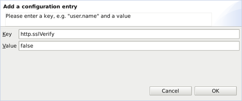
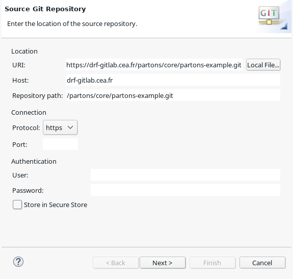
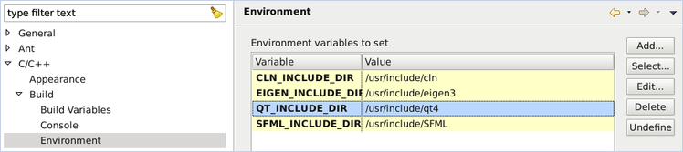
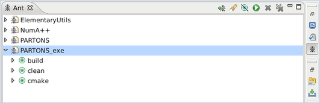
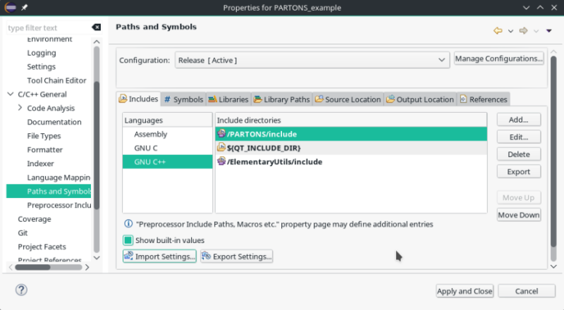

# Using Eclipse as IDE for %PARTONS {#eclipse}

[TOC]

# Introduction {#eclipse_intro}

This tutorial demonstrates how to use Eclipse CDT IDE in your work with %PARTONS. Eclipse is a very powerful tool that significantly improves the efficiency of code development. Due to the possibility of using plugins, Eclipse may be also used as a support for e.g. code commenting and version control. 

# Configuration of Eclipse to work with PARTONS {#eclipse_preparation}

If you are using [our virtual machine](@ref vm), you may skip this section, as Eclipse provided there is fully configured to work with %PARTONS. However, if you want to use your own installation, without the virtual machine, the tutorial found in this section will help you configure Eclipse properly. 

## Installation {#eclipse_preparation_installation}

You will need Eclipse (platform base), Eclipse CDT (support for C++) and EGit (plugin for Git revision control, if you want to clone the repositories directly from within Eclipse). On Linux systems, the installation of those components can be achieved by using the repositories:
~~~~~~~~~~~~~{.sh}
# on Debian-like (Debian, Ubuntu, etc.) distribution
sudo apt-get install eclipse eclipse-cdt eclipse-egit 
~~~~~~~~~~~~~
For other Linux distributions and operating systems, some adjustments may be needed. You will need also all libraries required by the compilation of %PARTONS. This subject is however covered in the installation tutorials of %PARTONS on [Linux](@ref linux) or [Mac](@ref mac). 

## Get PARTONS code {#eclipse_preparation_git}

In order to get %PARTONS, you can either download the code manually or you can use Eclipse EGit plugin. 

### Download code manually

To download the code manually visit the [Download](@ref download) page. 

All %PARTONS-related projects are equipped with Eclipse configuration files, so you can directly import them in Eclipse. To do so, use **File** > **Open Projects from File System** or **File** > **Import** > **General** > **File System** and choose the parent location of the projects. Select one or more entries from the list of detected projects and hit **Finish**.

If you intend to work only on your own program, do not import all the projects in Eclipse. Instead, you can install the %PARTONS libraries to your system by following the procedure described in the [installation guide](@ref linux_install). In that case, you only need to configure Eclipse to understand the includes of the headers, by indicating where they have been installed. See the [Troubleshooting](@ref eclipse_troubleshooting) section for more information. Note however, that we always recommend to import `partons-example` in Eclipse, so that you can adapt it to your needs and use it as a start for your own program.

### Use EGit plugin

The %PARTONS project uses the Git version control system. For users who wish to clone our Git repositories but do not have developer accounts, the authorization to our GitLab server on CEA can be done only via HTTPS protocol. However, you need to set up EGit (Eclipse Git plugin) to ignore SSL certificates, as the one issued by CEA is often not recognized properly. To do this, navigate through the Eclipse menu: **Window** > **Preferences** > **Team** > **Git** > **Configuration** > **User Setting**. Click on **Add Entry** button that will call a new window and set `http.https://drf-gitlab.cea.fr/.sslVerify` to `false`:

Click on **OK** button to close the new window, then hit **Apply** and again click on **OK** button to finish. 

With EGit, it is useful to use the **Git Repositories** view. To enable it, navigate through the Eclipse menu: **Window** > **Show View** > **Git Repositories** (the last one may be hidden in **Other**).

Once you have this **Git Repositories** view, click on **Clone a Git Repository** icon. In the new window, set URI to `%https://drf-gitlab.cea.fr/partons/core/partons-example.git`. %All other crucial elements should be filled automatically: 

Click on **Next** button. You should be able to select now the branch that you want to download, most probably the one corresponding to the latest release of %PARTONS. With the branch selected, click on **Next** button. Make sure that **Import all existing Eclipse projects after clone finishes** option is selected. Hit **Finish**. You should see now the imported project in the **Project Explorer** view. You can now follow `partons-example` as a template to build your own project on Eclipse.

If you wish also to contribute to the %PARTONS libraries, we recommend to import them in the same way and develop in Eclipse. Repeat the procedure described above for the other %PARTONS projects:
* `%https://drf-gitlab.cea.fr/partons/core/elementary-utils.git`
* `%https://drf-gitlab.cea.fr/partons/core/numa.git`
* `%https://drf-gitlab.cea.fr/partons/core/partons.git`

When you feel ready to push your contributions, you can either submit a patch, or ask for developer access (see the [Contact](@ref contact) page) to the repository (to be able to submit a merge request).

If you intend only to use these libraries, ignore the last paragraph. Just follow the procedure described in the [installation guide](@ref linux_install) to install the libraries, and see the [Troubleshooting](@ref eclipse_troubleshooting) section to configure Eclipse with the location of the headers.

## Set development environment {#eclipse_preparation_libs}

This step allows Eclipse to find external library headers used by %PARTONS. Without this step, Eclipse will mark any code that is using an unrecognized library as a wrong one. Auto-completion of includes - a very useful tool - will not work properly either. 

Navigate through the Eclipse menu: **Window** > **Preferences** > **C/C++** > **Build** > **Environment** and add the variables indicated in the following screenshot. Note, that the paths to the libraries may be different on your system. 

These variables are used by the configuration of PARTONS-related projects, as you can see by examining their Eclipse properties. Strictly speaking, not all variables are needed by each project, *e.g.* [partons-example](https://drf-gitlab.cea.fr/partons/core/partons-example) needs only `QT_INCLUDE_DIR`.

# Build projects {#eclipse_preparation_build}

The build is based on CMake, which is a cross-platform make system. Make sure to have it installed on your computer (command `cmake` should be available in the terminal). If CMake is missing, we refer to the tutorials explaining the installation of %PARTONS on [Linux](@ref linux) or [Mac](@ref mac).  

The build is automated by Ant scripts, which are small XML files scripting the call to `cmake`, `make`, etc. Those scripts are called `build.xml` and they can be found in each %PARTONS project. Open Eclipse **Ant** view by navigating through the Eclipse menu: **Window** > **Show View** > **Ant** (the last one may be hidden in **Other**). Click on **Add Buildfiles** button, select and expand the list for the first %PARTONS project, select `build.xml` and finish with **OK** button. Alternatively, you can also drag and drop `build.xml` file from the **Project explorer** view to the **Ant** view. Repeat this procedure for all other %PARTONS projects if needed. 

You can build now each of %PARTONS projects separately. Just remember to do this in the following order is you are a developer: 1) `elementary-utils`, 2) `numa`, 3) `partons`, 4) `partons-example`. In the **Ant** view, expand a given entry, and double click to perform one of the available operations:

# Run configuration {#eclipse_preparation_run}

If you prefer not to use the console, you can run %PARTONS within Eclipse. To achieve this, right-click in the **Project Explorer** view on the name of your %PARTONS executable project (`PARTONS_example` or your own project) and select: **Run As** > **Run Configurations**. A new window will appear. Select **C/C++ Application** in the list on the left side of this window and press on **New lunch configuration** button. Set **C/C++ Application** to `PARTONS_example` executable file in `bin` folder:

In the **Arguments** tab you can specify arguments passed to the executable, *e.g.* a path to an XML scenario that you want to run. Click on **Apply** button and **Run** if you want to run %PARTONS immediately. Later, use **Run** icon in Eclipse menu whenever you want to run %PARTONS (you may need to customize the toolbar to make this icon visible). 

# Troubleshooting {#eclipse_troubleshooting}

* If Eclipse does not recognize your includes of %PARTONS headers (because for instance you did not import %PARTONS libraries as projects in Eclipse, but instead you only have installed them in your system), you need to inform Eclipse of their location. Right-click on your executable project in the **Project Explorer** view, go to **Properties** > **C/C++ General** > **Paths and Symbols** > **Includes** tab > **GNU C**++ and add a link to your system installed headers (*e.g.* `/usr/local/include/PARTONS`, if you used the default installation location). The default links that can be seen in the screenshot below use the Eclipse workspace projects and therefore are not useful with the system installation. You can remove them, but do not remove the global variables such as `${QT_INCLUDE_DIR}`!.

* If the Ant view is not available within Eclipse, install the Eclipse Java Development Tools: either with **Help** > **Eclipse Marketplace** or **Help** > **Install New Software**. Alternatively, on Debian, the package `eclipse-jdt` (a dependency of `eclipse`) should provide it.

* If you are using Mac you may encounter this error when using `cmake` via *Ant* scripts: 
~~~~~~~~~~~~~{.sh}
Execute failed: java.io.IOException: Cannot run program "cmake" (in directory "..."): error=13, Permission denied
~~~~~~~~~~~~~
which appears as Eclipse is unable to find the CMake executable. To solve this problem right-click on one of the entries in the **Ant** view and navigate through the menu: **Run as** > **External Tools Configurations**. In the new window, select **Environment** tab. Click on **Select** button which will open a new dialog. Select **PATH** variable and click on **OK** button. Update the value by adding a path to the `cmake` executable, most likely `/usr/local/bin`. Unless CMake is installed in a custom place, you can get this path by running
~~~~~~~~~~~~~{.sh}
which cmake 
~~~~~~~~~~~~~
in your terminal. With `PATH` variable modified, click on **Apply** button and **Close** to finish.

* If you are developing for %PARTONS and if the Eclipse formatter (activated after pressing `Ctrl`+`Shift`+`F`) modifies files for no reason, it probably changes the way indentations are handled (white spaces or tabulations). Navigate through the Eclipse menu: `Windows` > `Preferences` > `C/C++` > `Code Style` > `Formatter`. Click on `Edit` button and make sure that `Tab policy` is set to `Spaces only`. If this is not the case, change it (you may need to create a new profile). 

# Tips {#eclipse_tips}

These shortcuts are essential and can be used each time you modify a file:
* `Ctrl`+`Shift`+`F`: call to the formatter; Eclipse handles indentation and spacing automatically.
* `Crtl`+`/`: Comment/uncomment selected block of code.
* `Shift`+`Alt`+`R`: Renaming of class, variable, etc. Eclipse will propagate your change to the whole workspace (handy it case of structural change that needs to be propagated to other projects).
* `Ctrl`+`Shift`+`O`: Eclipse handles includes automatically (yes, it generates the includes for you!).
* `Ctrl`+`Space`: Auto-completion (very handy!).

The last two will work correctly only if the indexer of Eclipse is up-to-date. You can update it by right-clicking on a given project, then choosing: **Index** > **Rebuild**. This can be also useful when Eclipse signals some errors in the code, due to a recent change in one of the dependent projects. You also need the headers location to be configured properly (see the [Troubleshooting](@ref eclipse_troubleshooting) section).
