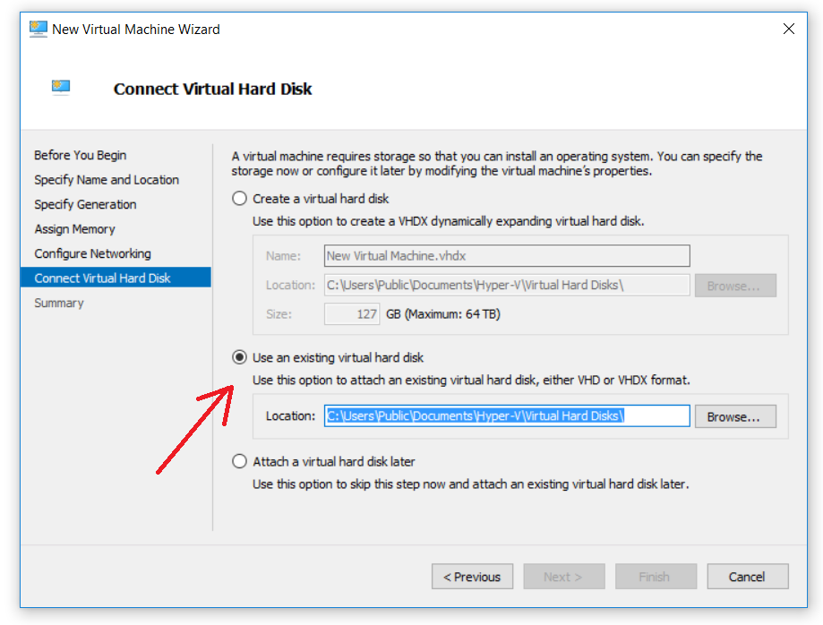

# Running %PARTONS with Hyper-V on Windows OS {#hyper-v}

[TOC]

%PARTONS team recommends to use VirtualBox as a software for virtual machine.
In [this tutorial](@ref vm) one can find detail instruction of the installation.

Before running %PARTONS with Hyper-V make sure that you enable it on Windows, see [official tutorial](https://docs.microsoft.com/en-us/virtualization/hyper-v-on-windows) for details.

# Conversion of OVA into VHD

Next, download the image of %PARTONS' virtual machine from [this page](@ref download_vm).
The image of the virtual machine is in `.ova` format and it has to be converted into suitable format in order to be included into Hyper-V.
The `.ova` file is a tar-archive which can be decompressed into two files: `.vmdk` and `.ovf`.

- The `.ovf` file stores information about the machine settings (vCPUs, Memory, NIC etc.).
The `.ovf` file is a .xml-file. You can launch the file in any browser/xml-parser. In our case this file will not be needed.

- The `.vmdk` file is a disk of a virtual machine and it has to be converted into a native Hyper-V diskimage(`.vhd` or `.vhdx`).
The VirtualBox provides suitable tool. After installing VirtualBox (see [this tutorial](@ref vm) for instruction), open the commandline and go to the directory where the `.vmdk` file is and type:

~~~~~~~~~~~~~{.sh}
"c:\Program Files\Oracle\VirtualBox\VBoxManage.exe" clonemedium --format vhd infile.vmdk outfile.vhd
~~~~~~~~~~~~~

If you installed the VirtualBox not in the default place, change `c:\Program Files\Oracle\VirtualBox\VBoxManage.exe` into your path to the `VBoxManage.exe` program.

- The more detailed instruction about conversion of Virtual Box file into Hyper-V file can be found on [this website](http://blog.worldofjani.com/?p=991).

# Running %PARTONS

Now open the Hyper-V, right-click on your computer and choose `New-> Virtual Machine`.
Choose the default options in the wizard up to the `Connect Virtual Hard Disk` tab.

In this tab, select *Use an existing virtual hard disk* and point the `.vhd` file that was created before, then click `Finish`.

In this moment you should be able to run the PARTONS virtual machine in Hyper-V.

# Network in Hyper-V

To connect virtual machine to the Internet in Hyper-V see [this tutorial](https://superuser.com/questions/469806/windows-8-hyper-v-how-to-give-vm-internet-access).

If after connecting the virtual switch there is still no Internet in the virtual machine make sure that following files looks like that:

~~~~~~~~~~~~~{.sh}
partons@partonsVM_DEV:~$ cat /etc/hostname
partonsVM_DEV
~~~~~~~~~~~~~

~~~~~~~~~~~~~{.sh}
partons@partonsVM_DEV:~$ cat /etc/hosts
127.0.0.1	localhost
127.0.1.1	partonsVM_DEV

# The following lines are desirable for IPv6 capable hosts
::1	localhost ip6-localhost ip6-loopback
ff02::1	ip6-allnodes
ff02::2	ip6-allrouters
~~~~~~~~~~~~~

~~~~~~~~~~~~~{.sh}
partons@partonsVM_DEV:~$ cat /etc/network/interfaces
# This file describes the network interfaces available on your system
# and how to activate them. For more information, see interfaces(5).

source /etc/network/interfaces.d/*

# The loopback network interface
auto lo
iface lo inet loopback

# The primary network interface
auto eth0
iface eth0 inet dhcp
~~~~~~~~~~~~~

Any of this file can be edit using command `sudo nano path_to_file`.
After making necessary changes use command

~~~~~~~~~~~~~{.sh}
sudo /etc/init.d/networking restart
~~~~~~~~~~~~~

to restart Internet connection. 