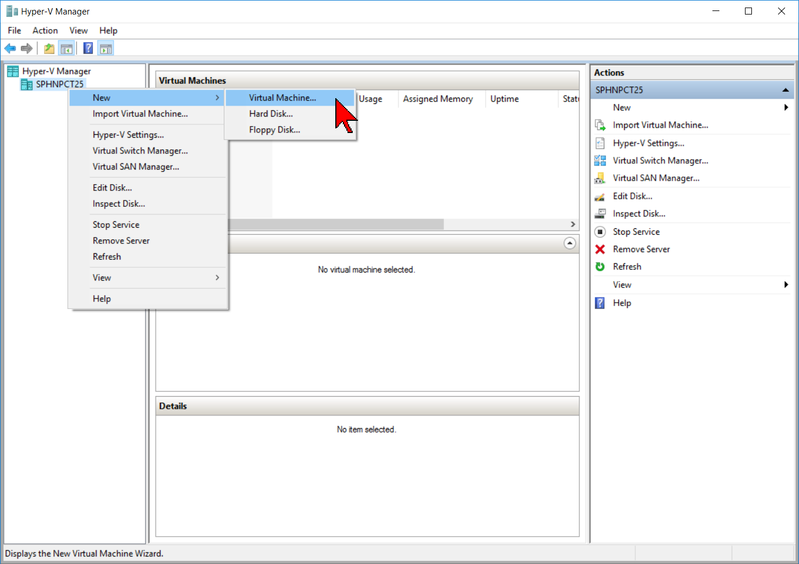
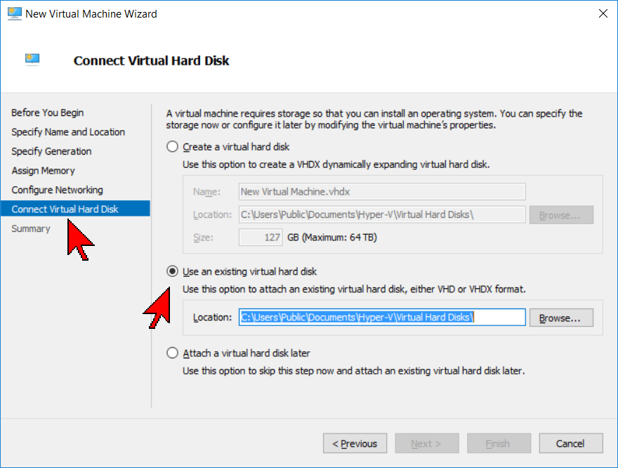
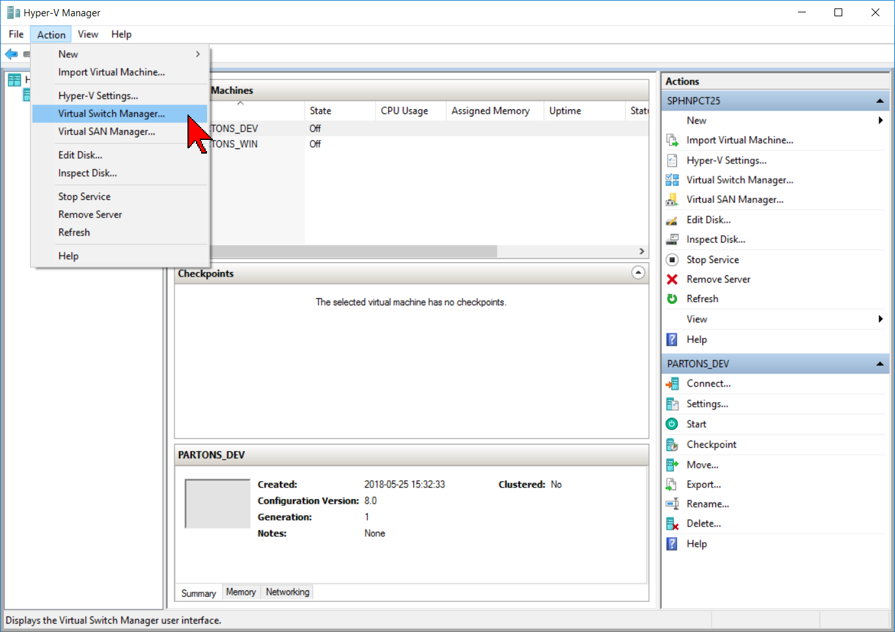
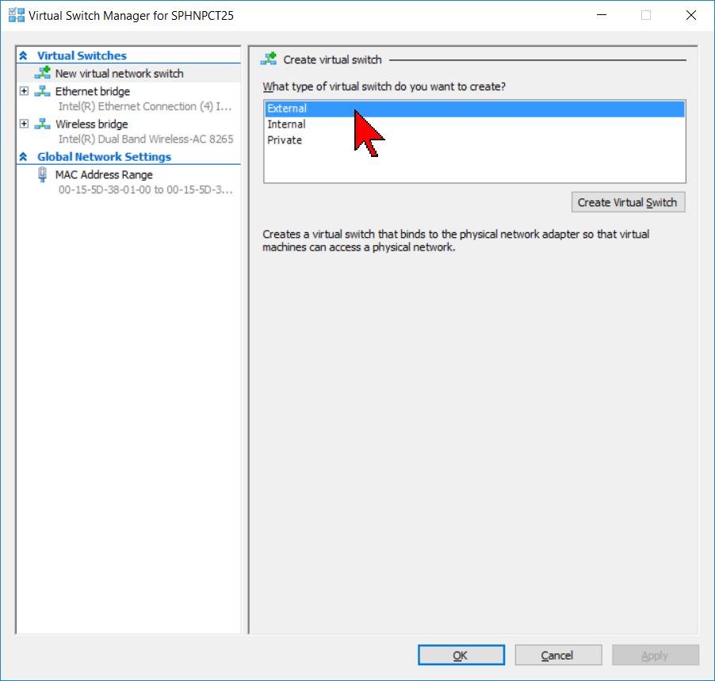
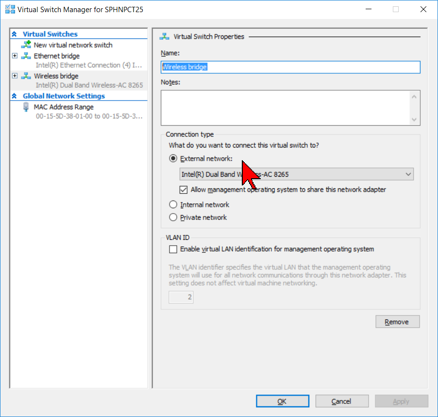
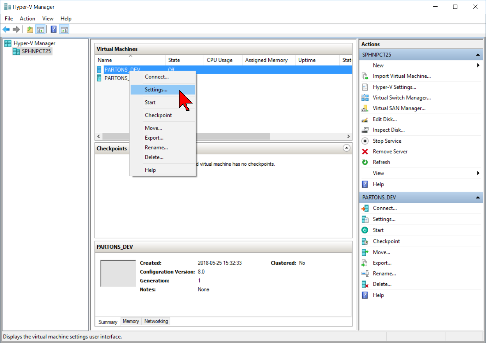
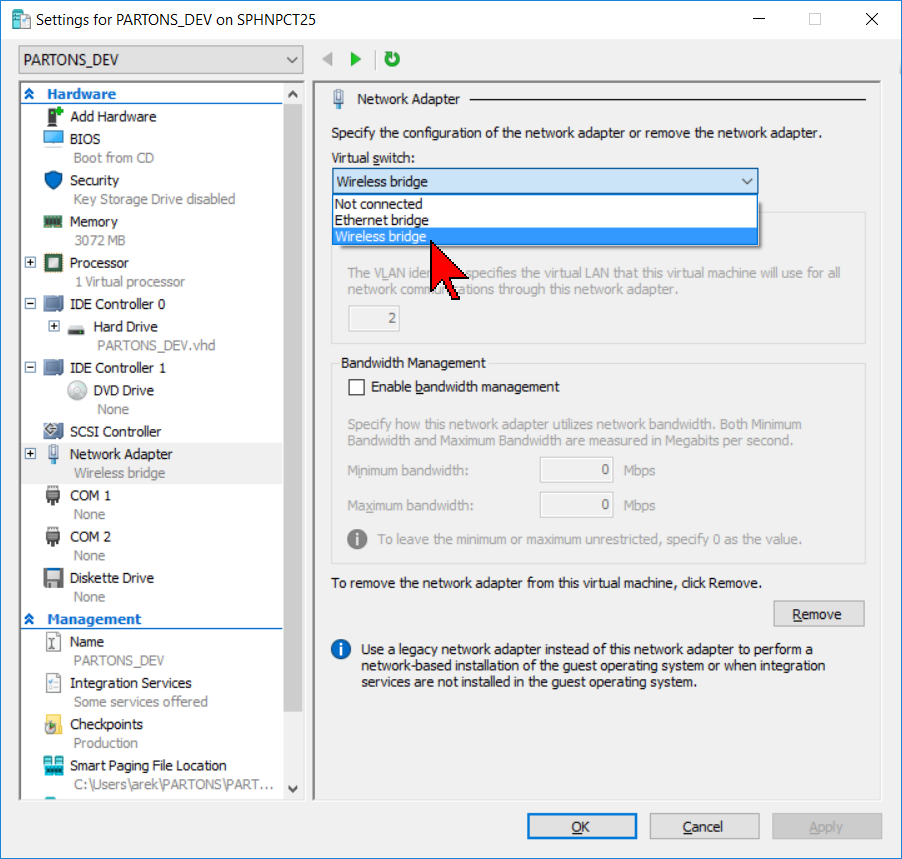

# Running %PARTONS with Hyper-V on Windows OS {#hyper-v}

[TOC]

# Introduction {#Hyper-V_intro}

We recommend that you use VirtualBox as a virtualization software to run %PARTONS, see [this tutorial](@ref vm). However, the usage of Hyper-V on Windows OS is also possible. 

Before any attempt to run %PARTONS with Hyper-V make sure that you enable it in Windows, see [the official Microsoft tutorial](https://docs.microsoft.com/en-us/virtualization/hyper-v-on-windows) for details.

# Conversion of OVA into VHD {#Hyper-V_conversion}

In order to use %PARTONS in Hyper-V the conversion of provided `.ova` file to a suitable format is necessary.

Download the image of %PARTONS virtual machine from [this page](@ref download_vm).
This image is in `.ova` format and it has to be converted into that used by Hyper-V.
The `.ova` file is a tar-archive that can be decompressed into two files: `.ovf` and `.vmdk`.

- The `.ovf` file describes the properties of the virtual system (vCPUs, Memory, NIC etc.).
It is in xml format, so you can launch it with any browser/xml-parser. In our case this file will not be needed.

- The `.vmdk` file is a disk image used by VirtualBox and it has to be converted into a disk image used by Hyper-V (`.vhd` or `.vhdx`).
VirtualBox provides a convenient tool to make the necessary conversion. Even though you are not going to use VirtualBox later, it is good to install it to make the conversion easy. After installing VirtualBox (see [this tutorial](@ref vm) for instruction), open the command line tool, go to the directory where the `.vmdk` file is located and type:

~~~~~~~~~~~~~{.sh}
"c:\Program Files\Oracle\VirtualBox\VBoxManage.exe" clonemedium --format vhd infile.vmdk outfile.vhd
~~~~~~~~~~~~~

Change `infile.vmdk` into the name of disk image that you have obtained from the extraction of `.ova` file.
You can change `outfile.vhd` into a more applicable name. 
If VirtualBox has not been installed in the default place, change `c:\Program Files\Oracle\VirtualBox\VBoxManage.exe` to the path of your `VBoxManage.exe` executable.
A more detailed instruction about the conversion of VirtualBox files into Hyper-V native files can be found on [this website](http://blog.worldofjani.com/?p=991).

# Running PARTONS {#Hyper-V_run}

Open the Hyper-V Manager. Right-click on your computer name in the left panel of the Hyper-V and choose `New -> Virtual Machine` .

Choose default options in the wizard up to the `Connect Virtual Hard Disk` tab.

In this tab, select `Use an existing virtual hard disk` and point the `.vhd` file that you have created before, then click `Finish`.

At this moment you should be able to run the %PARTONS virtual machine in Hyper-V.

# Network in Hyper-V {#Hyper-V_network}

In order to connect the Internet in your VM you have to associate it to the Ethernet/Wireless NIC Card.
In order to do so you have to create a Virtual Switch.

1. Open your Hyper-V Manager.

2. Select `Action -> Virtual Switch Manager`.

   

3. Click on `New virtual network switch`, then select `External` and `Create Virtual Switch`.

   

4. Give the switch a name and then select the `External network` you use to connect to the Internet (Ethernet, or Wireless, etc,.)

   

   Note: You must select the device that you are actually using to connect to the Internet, *i.e.* if your computer is set up to use Wifi or Ethernet, but is currently using Wifi, you must use Wifi - the Ethernet connection will not work because the host machine isn't currently using it.

5. Select `Apply` and then `OK`.

6. Right-click on the Virtual Machine you want to connect and select `Settings`.

   

7. Under the `Network Adapter` setting select the newly created Virtual Switch

   

This should enable the Internet connection in your Hyper-V.
The above descriptions comes from [this tutorial](https://superuser.com/questions/469806/windows-8-hyper-v-how-to-give-vm-internet-access).

# Tips and troubleshooting {#Hyper-V_tips}

If after connecting the virtual switch you still don't have Internet in the virtual machine make sure that following files looks like these:

~~~~~~~~~~~~~{.sh}
partons@partonsVM_DEV:~$ cat /etc/hostname
partonsVM_DEV
~~~~~~~~~~~~~

~~~~~~~~~~~~~{.sh}
partons@partonsVM_DEV:~$ cat /etc/hosts
127.0.0.1	localhost
127.0.1.1	partonsVM_DEV

# The following lines are desirable for IPv6 capable hosts
::1	localhost ip6-localhost ip6-loopback
ff02::1	ip6-allnodes
ff02::2	ip6-allrouters
~~~~~~~~~~~~~

~~~~~~~~~~~~~{.sh}
partons@partonsVM_DEV:~$ cat /etc/network/interfaces
# This file describes the network interfaces available on your system
# and how to activate them. For more information, see interfaces(5).

source /etc/network/interfaces.d/*

# The loopback network interface
auto lo
iface lo inet loopback

# The primary network interface
auto eth0
iface eth0 inet dhcp
~~~~~~~~~~~~~

Any of these files can be edit using command `sudo nano path_to_file`.
After making necessary changes use command

~~~~~~~~~~~~~{.sh}
sudo /etc/init.d/networking restart
~~~~~~~~~~~~~

to restart Internet connection. 
